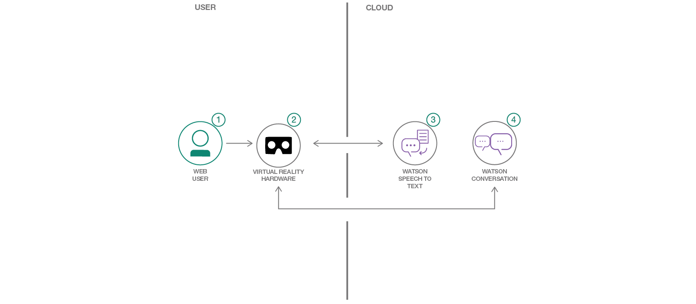

# Create voice commands for VR experiences with Watson services

*Read this in other languages: [한국어](README-ko.md).*

In this Code Pattern we will create a Virtual Reality game based on Watson's [Speech-to-Text](https://www.ibm.com/watson/developercloud/speech-to-text.html) and Watson's [Conversation](https://www.ibm.com/watson/developercloud/conversation.html) services.

In Virtual Reality, where you truly “inhabit” the space, speech can feel like a more natural interface than other methods. Providing speech controls allows developers to create more immersive experiences. The HTC Vive is the 3rd most popular head-mounted VR devices (not including Google Cardboard) and an ideal candidate for Speech interaction, selling roughly [400 thousand units](http://www.hypergridbusiness.com/2016/11/report-98-of-vr-headsets-sold-this-year-are-for-mobile-phones) in 2016.

When the reader has completed this Code Pattern, they will understand how to:

* Add IBM Watson Speech-to-Text and Conversation to a Virtual Reality environment build in Unity.



## Flow

1. User interacts in virtual reality and gives voice commands such as "Create a large black box".
2. The HTC Vive Headset microphone picks up the voice command and the running application sends it to Watson Speech-to-Text.
3. Watson Speech-to-Text converts the audio to text and returns it to the running Application that powers the HTC Vive.
4. The application sends the text to Watson Conversation. Watson conversation returns the recognized intent "Create" and the entities "large", "black", and "box". The virtual reality application then displays the large black box (which falls from the sky).

## Included components

* [IBM Watson Conversation](https://www.ibm.com/watson/developercloud/conversation.html): Create a chatbot with a program that conducts a conversation via auditory or textual methods.
* [IBM Watson Speech-to-Text](https://www.ibm.com/watson/developercloud/speech-to-text.html): Converts audio voice into written text.

## Featured technologies

* [Unity](https://unity3d.com/): A cross-platform game engine used to develop video games for PC, Mac, consoles, mobile devices and websites.

# Watch the Video

[](https://youtu.be/h5nY3st62Qg)

# Steps

1. [Before you begin](#1-before-you-begin)
2. [Create IBM Cloud services](#2-create-ibm-cloud-services)
3. [Building and Running](#3-building-and-running)

## 1. Before You Begin

* [IBM Cloud Account](http://ibm.biz/Bdimr6)
* ["VR Ready" PC](https://www.vive.com/us/ready/)
* [HTC Vive](https://www.vive.com/us/product/)
* [SteamVR](http://store.steampowered.com/steamvr)
* [Unity](https://unity3d.com/get-unity/download)
* [Blender](https://www.blender.org/)

## 2. Create IBM Cloud services

On your local machine:
1. `git clone https://github.com/IBM/vr-speech-sandbox-vive.git`
2. `cd vr-speech-sandbox-vive`

In [IBM Cloud](https://console.ng.bluemix.net/):

1. Create a [Speech-To-Text](https://console.ng.bluemix.net/catalog/speech-to-text/) service instance.
2. Create a [Conversation](https://console.ng.bluemix.net/catalog/services/conversation/) service instance.
3. Once you see the services in the Dashboard, select the Conversation service you created and click the  button.
4. After logging into the Conversation Tool, click the  button.
5. Import the Conversation [`workspace.json`](data/workspace.json) file located in your clone of this repository.

## 3. Building and Running

If you followed the previous steps you should already be inside your local clone and ready to get started running the app from Unity.

> Note: This has been compiled and tested using Unity 5.6.5f1 and Watson Unity SDK from the Unity asset Store (or alternately use the develop branch)

1. Either download the Watson Unity SDK from the Unity asset store or perform the following:
`git clone https://github.com/watson-developer-cloud/unity-sdk.git`
2. Open Unity and inside the project launcher select the  button.
3. Navigate to where you cloned this repository and open the `Creation Sandbox` directory.
4. If prompted to upgrade the project to a newer Unity version, do so.
5. Follow [these instructions](https://github.com/watson-developer-cloud/unity-sdk#getting-the-watson-sdk-and-adding-it-to-unity) to add the Watson Unity SDK downloaded in step 1 to the project.
6. Follow [these instructions](https://github.com/watson-developer-cloud/unity-sdk#configuring-your-service-credentials) to create your Speech To Text and Conversation services and find their credentials (using [IBM Cloud](https://console.ng.bluemix.net/)).
7. Open the script `vr-speech-sandbox-vive/Creation Sandbox/Assets/Scripts/SpeechSandboxStreaming.cs`
8. Fill in the credentials for Speech to Text and Conversation, and the Conversation workspace id:
```
    private string stt_username = "";
    private string stt_password = "";
    // Change stt_url if different from below
    private string stt_url = "https://stream.watsonplatform.net/speech-to-text/api";

    private string convo_username = "";
    private string convo_password = "";
    // Change convo_url if different from below
    private string convo_url = "https://gateway.watsonplatform.net/conversation/api";
    // Change  _conversationVersionDate if different from below
    private string _conversationVersionDate = "2017-05-26";
    private string convo_workspaceId = "";
```

9. Install [Blender](https://www.blender.org)
10. In the Unity editor project tab, select `Assets`->`Scenes`->`MainGame`->`MainMenu` and double click to load the scene.
11. Press Play

# Links

* [Youtube Video](https://youtu.be/h5nY3st62Qg)
* [Demo of Cardboard version on Youtube](https://www.youtube.com/watch?v=rZFpUpy4y0g)
* [Viveport](https://www.viveport.com/apps/bbde0cff-98c1-4117-acd8-e808ded515ca)
* [Watson Unity SDK](https://github.com/watson-developer-cloud/unity-sdk)
* [Blog](https://developer.ibm.com/code/2017/04/29/easily-set-voice-commands-virtual-reality-watson/)
* [Another blog!](https://developer.ibm.com/code/2017/06/10/create-affordable-virtual-reality-experience-google-cardboard/)
* [Article about VR Speech Sandbox](https://www.techleer.com/articles/385-ibm-watson-to-get-a-new-vr-speech-sandbox-feature/)
* [News article about Star Trek Bridge Crew](https://www.prnewswire.com/news-releases/ibm-and-ubisoft-partner-to-bring-voice-command-with-watson-to-virtual-reality-in-star-trek-bridge-crew-300455924.html)


# Learn more

* **Artificial Intelligence Code Patterns**: Enjoyed this Code Pattern? Check out our other [AI Code Patterns](https://developer.ibm.com/code/technologies/artificial-intelligence/).
* **AI and Data Code Pattern Playlist**: Bookmark our [playlist](https://www.youtube.com/playlist?list=PLzUbsvIyrNfknNewObx5N7uGZ5FKH0Fde) with all of our Code Pattern videos
* **With Watson**: Want to take your Watson app to the next level? Looking to utilize Watson Brand assets? [Join the With Watson program](https://www.ibm.com/watson/with-watson/) to leverage exclusive brand, marketing, and tech resources to amplify and accelerate your Watson embedded commercial solution.

# License

[Apache 2.0](LICENSE)
